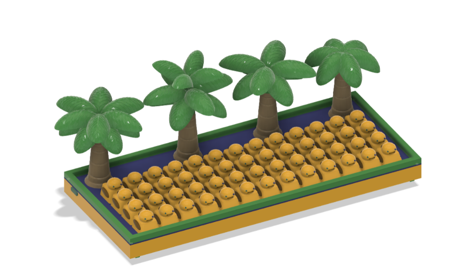
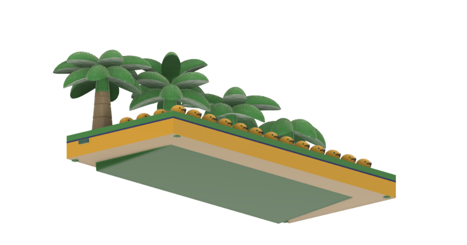
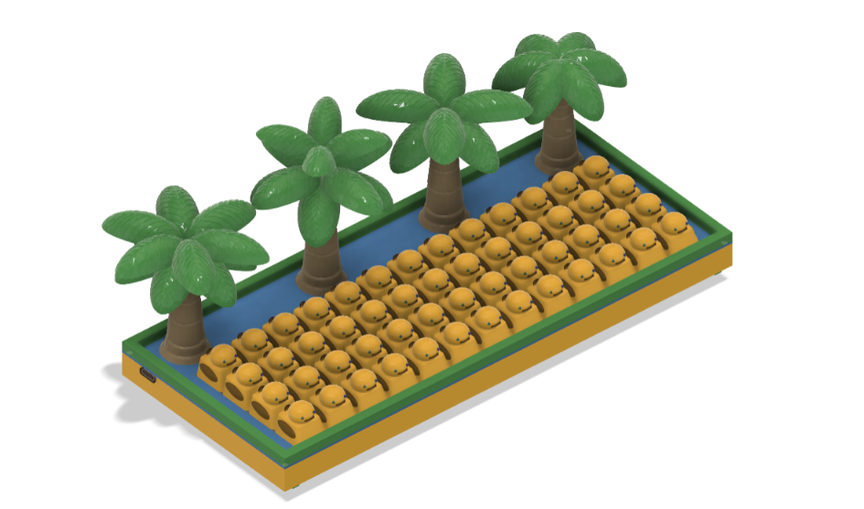
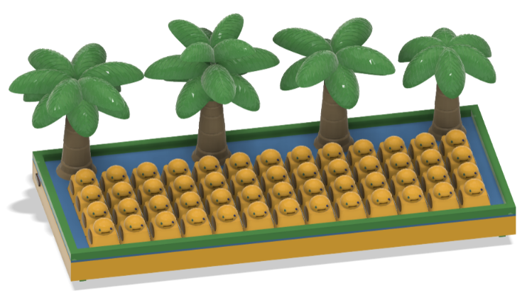

# Duck Keyboard

Why are the Space and Tab keys so big? Completely unnecessary.

We are not accountants. Why should some keys get more space than others?

We demand equality. Equality and ducks.

**52 keys. Zero keycap inequality.**

Ducks, palm trees, and pure summer vibes. Tactile. Compact.

And yes — it quacks when you press it.

Built for minimalists who still want to have fun.

## Features

* 52-key compact layout
* Uniform key sizes with no oversized Space or Tab keys
* Tactile typing experience
* Custom duck-themed design
* Compact footprint for minimalist setups
* Integrated sound effects: every keypress quacks

## Design Philosophy

Most keyboards dedicate excessive space to a handful of keys while the rest compete for room.

The Duck Keyboard rejects keycap inequality. Every key deserves equal treatment. 

## Zine

## CAD Model and Case

The keyboard case uses Gasket Mounting and was designed to complement the compact layout while maintaining a clean, minimalist appearance.

|  |  |

|  |  |

## Electronics

### Schematic

The keyboard electronics are based on a custom schematic designed usinf KiCAD.

### PCB

The custom PCB uses ESP32 Feather.

#### 3D PCB View

## Assembly Instructios
1. Flash the ESP32 Feather with the firmware.
2. Solder the hot-swap sockets and the ESP32 Feather to the PCB.
3. Install the switches into the hot-swap sockets.
4. 3D print the top case, bottom case, and keycaps.
5. Place the PCB assembly into the case and secure it using M2 screws.
6. Install the keycaps onto the switches.
7. 3D print the decorative duck and palm tree elements.
8. Attach the decorations to the designated area of the top case using instant glue (cyanoacrylate).
9. (Optional) Print the angle-of-attack wedge to tilt the keyboard toward the user for a more comfortable typing position.

## File Structure

The project layout is:

- `BoM.csv`
- `README.md`
- `CAD_Fusion/`
  - `ESP32-WROOM32-DEVBOARD_DIMENTIONS.f3d`
  - `Downloaded/`
  - `FullAssembly/`
  - `PCB/`
  - `SeparateElements/`
- `Docs/`
  - `ESP32HUZZAH32.txt`
  - `keyboard-layout.json`
  - `Links_to_parts.txt`
- `Hardware/`
  - `keyboard.kicad_sch`
  - `keyboard.kicad_pcb`
  - `keyboard.kicad_pro`
  - `keyboard.kicad_prl`
  - `keyboard-backups/`
  - `Libraries/`
- `Images/`
  - `CAD/`
  - `PCB/`
- `macropad/`
  - `Firmware/`
  - `kicad_care_package/`
  - `kicad_macropad_project/`
- `Symbols/`

## Firmware

Refer to [Firmware ReadMe](Firmware/README.md)

